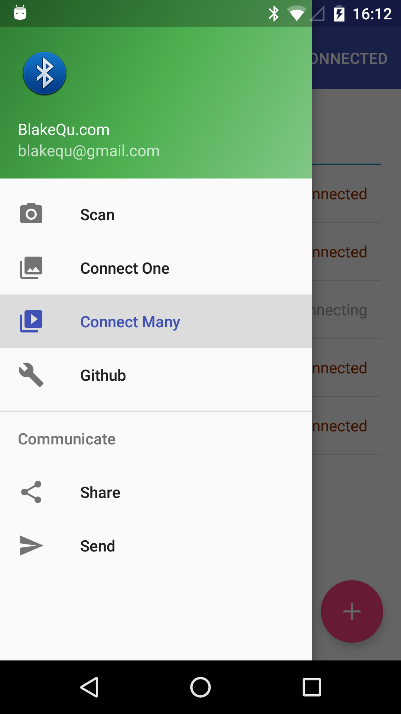
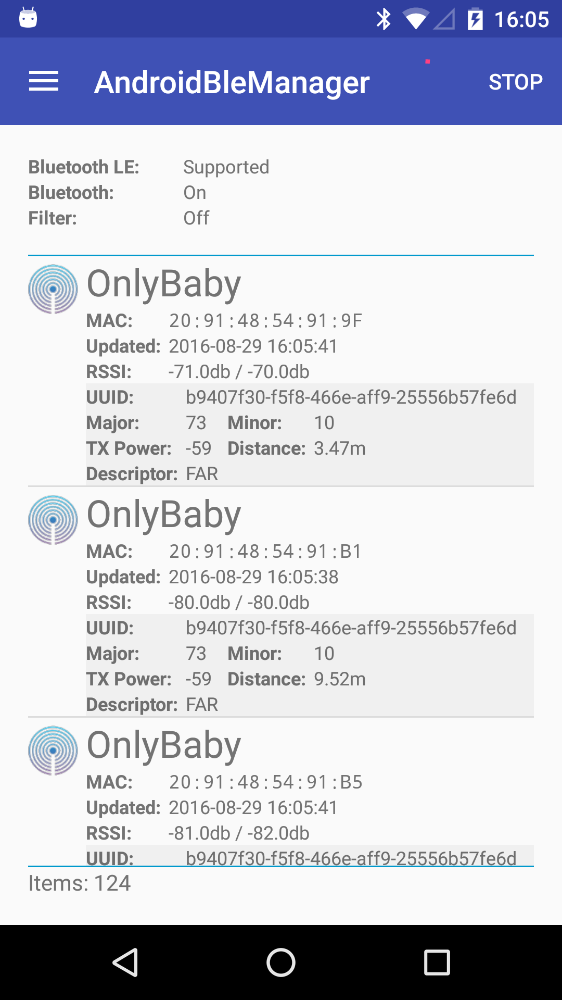
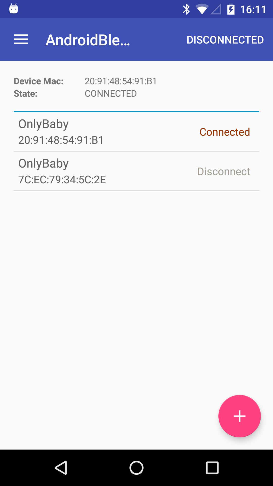
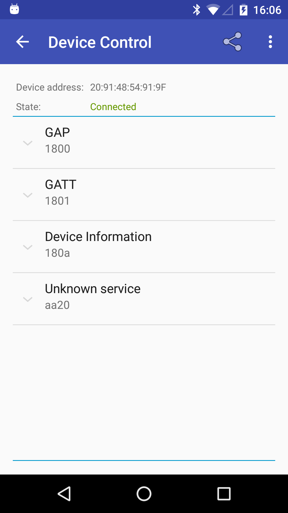
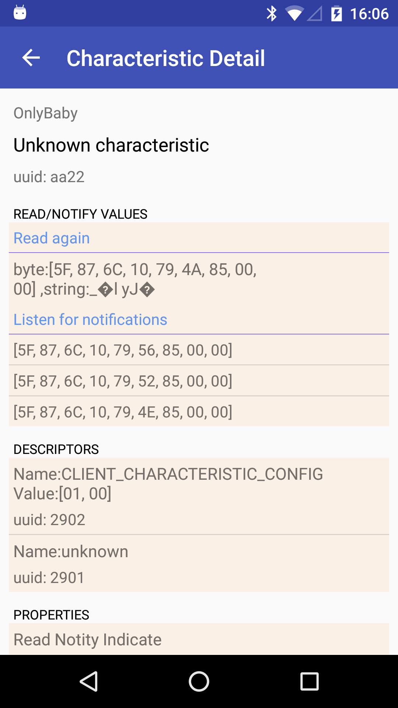
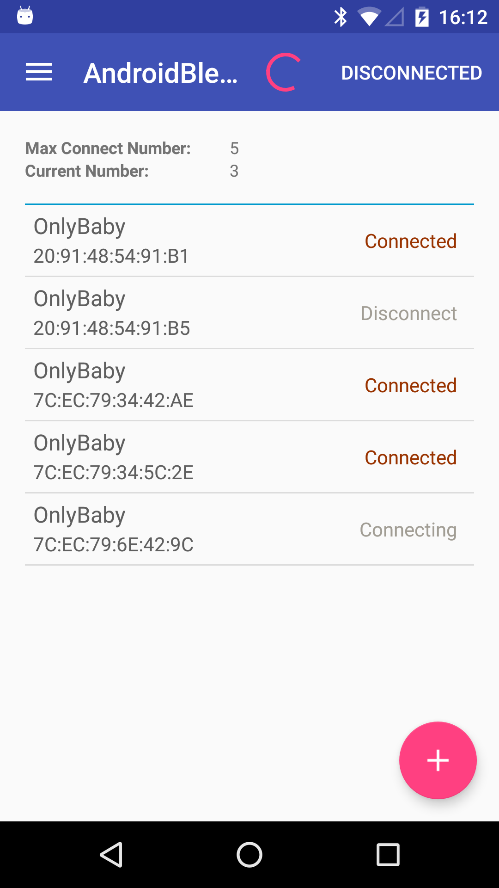
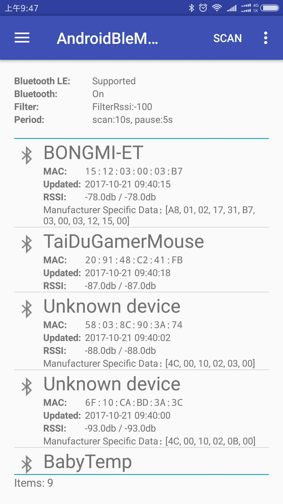
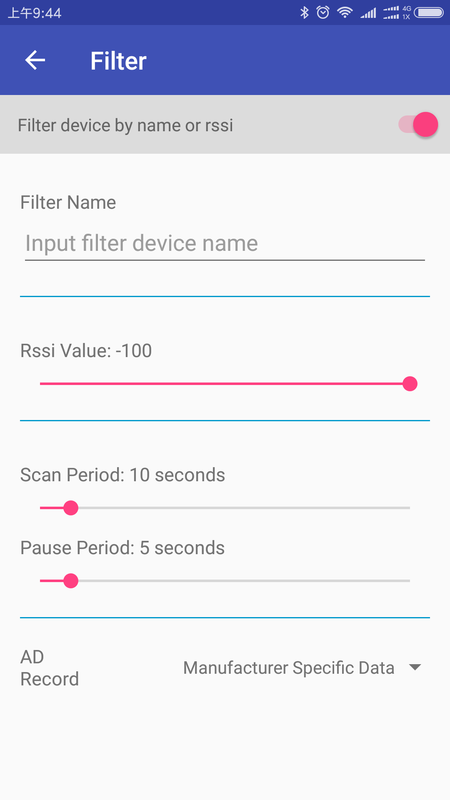

# [English version](README-en.md)

OpOp
> 强大的蓝牙工具库

<!-- [](https://travis-ci.org/haodynasty/AndroidBleManager) -->
[![License][licence_svg]][licence_url]
[![Download][bintray_svg]][bintray_url]

- 集成Android蓝牙（支持Ibeacon）扫描，单个设备连接，多设备同时连接，连接Gatt服务扫描及属性读取封装
- 使用简单快捷，一键集成
- 经过实际场景测试，实际产品的使用

# 使用
将下面的代码增加到build.gradle文件中,${latest.version} is [![Download][bintray_svg]][bintray_url]
```
dependencies {
    compile 'com.blakequ.androidblemanager:bluetooth-manager-lib:${latest.version}'
}
```
maven
```
<dependency>
  <groupId>com.blakequ.androidblemanager</groupId>
  <artifactId>bluetooth-manager-lib</artifactId>
  <version>${latest.version}</version>
  <type>pom</type>
</dependency>
```


# 1. 功能特性
## 1.1 扫描
- 支持低版本扫描兼容。对SDK<23和>=23的蓝牙扫描进行了封装，对外没有区别，自动识别使用的扫描接口（可指定低版本扫描，有些手机使用低版本才能扫描到）
- 支持低功耗扫描。支持不间断扫描同时考虑功耗，支持在前台高频扫描后台低频扫描，原理和测试参考[链接](https://github.com/Sensoro/SDK-Android/blob/master/Documents/Battery-Management.md)
- 支持Ibeacon识别。自动识别Ibeacon设备并解析ibeacon的数据
- 支持循环扫描（可暂停），启动后台扫描时节约60%的电量

## 1.2 单个设备连接
- 支持单个设备连接。完善的Gatt管理机制，防止连接多个设备，具有连接排他性，保证永远只有一个设备连接
- 简化连接接口。不用关注连接细节和切换断开时资源释放问题（133错误经常发生）
- 支持断开后自动重连。当连接断开后支持自动重连，重连时间和下一次连接时间成正比增加，防止不间断重连
- 支持连接状态实时监听。使用回调监听连接状态（连接中，连接上，断开）

## 1.3 多个设备连接
- 支持同时连接多个蓝牙设备（最多连接设备数可设置）。完善的Gatt管理机制，不用担心多设备连接时资源释放问题。
- 支持多设备连接状态实时监听。
- 支持多设备断开后自动重连。并且自动重连的时间间隔会随着重连次数增加自动增长（防止不间断连接）
- 使用简单：添加多个设备-开始连接-最后释放资源即可（支持连接过程中动态添加设备）

# 2. 图片预览
<p>






</p>

# 3. 使用说明
## 3.1 扫描
- 获取扫描管理器
```
BluetoothScanManager scanManager = BleManager.getScanManager(context);
```

- 开始扫描
```
scanManager.addScanFilterCompats(new ScanFilterCompat.Builder().setDeviceName("oby").build());

        scanManager.setScanOverListener(new ScanOverListener() {
                    @Override
                    public void onScanOver() {
                        //scan over of one times
                    }
                });
                
        scanManager.setScanCallbackCompat(new ScanCallbackCompat() {
            @Override
            public void onBatchScanResults(List<ScanResultCompat> results) {
                super.onBatchScanResults(results);
            }
            
            @Override
            public void onScanFailed(final int errorCode) {
                super.onScanFailed(errorCode);
                //code
            }

            @Override
            public void onScanResult(int callbackType, ScanResultCompat result) {
                super.onScanResult(callbackType, result);
                //scan result
            }
        });
        //start scan
        scanManager.startCycleScan(); //不会立即开始，可能会延时
        //scanManager.startScanNow(); //立即开始扫描
```

- 暂停扫描
```
scanManager.stopCycleScan();
//is scanning
scanManager.isScanning()
```

- 资源释放
```
scanManager.release();
```

- 其他
```
getPowerSaver(); //可以参考具体使用方法BackgroundPowerSaver，可以设置循环扫描前台和后台扫描和间隔的时间
startScanOnce(); //单次扫描，只扫描一次
setAPI21ScanningDisabled(false); //禁止使用新的扫描方式
```

- 注意事项
> 扫描结果回调已经放在了主线程，可直接使用并更新视图UI

## 3.2 单设备连接
- 获取连接管理器
```
BluetoothConnectManager connectManager = BleManager.getConnectManager(context);
```
- 连接状态监听
```
//如果不用需要移除状态监听removeConnectStateListener
connectManager.addConnectStateListener(new ConnectStateListener() {
            @Override
            public void onConnectStateChanged(String address, ConnectState state) {
                switch (state){
                    case CONNECTING:
                        break;
                    case CONNECTED:
                        break;
                    case NORMAL:
                        break;
                }
            }
        });
connectManager.setBluetoothGattCallback(new BluetoothGattCallback() {
    ...
    //注意：里面的回调方法都是在非主线程
}
```

- 蓝牙读写数据与通知

为了简化蓝牙连接，已经自动封装了蓝牙Gatt的读写和通知。
    - 传统方式
```
private BluetoothGatt mBluetoothGatt;
BluetoothGattCharacteristic characteristic;
boolean enabled;
... 
mBluetoothGatt.setCharacteristicNotification(characteristic, enabled); 
... 
BluetoothGattDescriptor descriptor = characteristic.getDescriptor(
        UUID.fromString(SampleGattAttributes.CLIENT_CHARACTERISTIC_CONFIG));
descriptor.setValue(BluetoothGattDescriptor.ENABLE_NOTIFICATION_VALUE); 
mBluetoothGatt.writeDescriptor(descriptor);
```
    - 封装使用
```
//start subscribe auto
//1.set service uuid(将要读取GattService的UUID)
connectManager.setServiceUUID(serverUUid.toString());
//2.clean history descriptor data（清除历史订阅读写通知）
 connectManager.cleanSubscribeData();
//3.add subscribe params（读写和通知）
connectManager.addBluetoothSubscribeData(
          new BluetoothSubScribeData.Builder().setCharacteristicRead(characteristic.getUuid()).build());//read characteristic
connectManager.addBluetoothSubscribeData(
          new BluetoothSubScribeData.Builder().setCharacteristicNotify(characteristic.getUuid()).build()); //notify
connectManager.addBluetoothSubscribeData(
          new BluetoothSubScribeData.Builder().setCharacteristicWrite(characteristic.getUuid()).build()); //write characteristic
connectManager.addBluetoothSubscribeData(
                        new BluetoothSubScribeData.Builder().setCharacteristicWrite(characteristic.getUuid(), byteData).build();
//还有读写descriptor
//start subscribe(注意，在使用时当回调onServicesDiscovered成功时会自动调用该方法，所以只需要在连接之前完成1,3步即可),如果需要单独读写某些属性，则可以单独调用该方法，并且同样使用步骤2,3然后调用该方法手动启动订阅
boolean isSuccess = connectManager.startSubscribe(gatt); //返回是否成功实现订阅
```

- 连接与断开
```
connect(macAddress);
disconnect(macAddress);
closeAll(); //关闭所有连接设备
getConnectedDevice(); //获取当前已经连接的设备列表
getCurrentState(); //获取当前设备状态
```

- 资源释放
```
scanManager.release();
```

- 注意事项
> 设备的连接，断开尽量在主线程中完成，否则在某些机型（三星）会出现许多意想不到的错误。

## 3.3 多设备连接
- 获取多设备连接管理器
```
MultiConnectManager multiConnectManager = BleManager.getMultiConnectManager(context);
```

- 添加状态监听
```
//如果不用需要移除状态监听removeConnectStateListener
connectManager.addConnectStateListener(new ConnectStateListener() {
            @Override
            public void onConnectStateChanged(String address, ConnectState state) {
                switch (state){
                    case CONNECTING:
                        break;
                    case CONNECTED:
                        break;
                    case NORMAL:
                        break;
                }
            }
        });
connectManager.setBluetoothGattCallback(new BluetoothGattCallback() {
    ...
    //注意：里面的回调方法都是在非主线程
}
```

- 添加待设备到队列
如果添加的设备超过了最大连接数，将会自动移除多余的设备
```
addDeviceToQueue(deviceList);
//手动移除多余的连接设备
removeDeviceFromQueue(macAddress);
```

- 蓝牙读写数据与通知
```
//start subscribe auto
//1.set service uuid(将要读取GattService的UUID)
connectManager.setServiceUUID(serverUUid.toString());
//2.clean history descriptor data（清除历史订阅读写通知）
 connectManager.cleanSubscribeData();
//3.add subscribe params（读写和通知）
connectManager.addBluetoothSubscribeData(
          new BluetoothSubScribeData.Builder().setCharacteristicRead(characteristic.getUuid()).build());//read characteristic
connectManager.addBluetoothSubscribeData(
          new BluetoothSubScribeData.Builder().setCharacteristicNotify(characteristic.getUuid()).build()); //notify
connectManager.addBluetoothSubscribeData(
          new BluetoothSubScribeData.Builder().setCharacteristicWrite(characteristic.getUuid()).build()); //write characteristic
connectManager.addBluetoothSubscribeData(
                        new BluetoothSubScribeData.Builder().setCharacteristicWrite(characteristic.getUuid(), byteData).build();
//还有读写descriptor
//start descriptor(注意，在使用时当回调onServicesDiscovered成功时会自动调用该方法，所以只需要在连接之前完成1,3步即可)
connectManager.startSubscribe(gatt);
```

- 开始连接
```
startConnect();
//连接其中的指定设备
startConnect(String);
```

- 资源释放
```
scanManager.release();
```

- 其他
```
getQueueSize(); //当前队列中设备数
setMaxConnectDeviceNum(); //设置最大连接数量
getMaxLen(); //获取最大的连接数量
getConnectedDevice(); //获取已经连接的设备
getDeviceState(macAddress); //获取当前设备连接状态
getAllDevice();
getAllConnectedDevice();
getAllConnectingDevice();
```

## 3.4 个性化扫描和连接配置
1. 可设置参数如下：
```
boolean isDebugMode = false; //是否为debug模式，建议使用BuildConfig.DEBUG设置，如果为true则打印日志
long foregroundScanPeriod = 10000; //在前台时（可见扫描界面）扫描持续时间
long foregroundBetweenScanPeriod = 5000; //在前台时（可见扫描界面）扫描间隔暂停时间，我们扫描的方式是间隔扫描
long backgroundScanPeriod = 10000; //在后台时（不可见扫描界面）扫描持续时间
long backgroundBetweenScanPeriod = 5 * 60 * 1000; //在后台时（不可见扫描界面）扫描间隔暂停时间，我们扫描的方式是间隔扫描
int maxConnectDeviceNum = 5;//一次最多连接设备个数
int reconnectStrategy = 3; //如果连接自动断开之后的重连策略（ConnectConfig.RECONNECT_LINEAR，ConnectConfig.RECONNECT_EXPONENT，ConnectConfig.RECONNECT_LINE_EXPONENT,ConnectConfig.RECONNECT_FIXED_TIME）
int reconnectMaxTimes = Integer.MAX_VALUE; //最大重连次数，默认可一直进行重连
long reconnectBaseSpaceTime = 8000; //重连基础时间间隔ms，重连的时间间隔
int reconnectedLineToExponentTimes = 5; //快速重连的次数(线性到指数，只在reconnectStrategy=ConnectConfig.RECONNECT_LINE_EXPONENT时有效)
int connectTimeOutTimes = 15000; //连接超时时间15s,15s后自动检测蓝牙状态（如果设备不在连接范围或蓝牙关闭，则重新连接的时间会很长，或者一直处于连接的状态，现在超时后会自动检测当前状态）
```
2. 使用方法
```
BleManager.setBleParamsOptions(new BleParamsOptions.Builder()
                .setBackgroundBetweenScanPeriod(5 * 60 * 1000)
                .setBackgroundScanPeriod(10000)
                .setForegroundBetweenScanPeriod(5000)
                .setForegroundScanPeriod(10000)
                .setDebugMode(BuildConfig.DEBUG)
                .setMaxConnectDeviceNum(5)
                .setReconnectBaseSpaceTime(8000)
                .setReconnectMaxTimes(Integer.MAX_VALUE)
                .setReconnectStrategy(ConnectConfig.RECONNECT_LINE_EXPONENT)
                .setReconnectedLineToExponentTimes(5)
                .setConnectTimeOutTimes(20000)
                .build());
```

# 4. 权限
使用时需要如下权限
* `android.permission.BLUETOOTH`
* `android.permission.BLUETOOTH_ADMIN`

if SDK >= 23, 增加权限

* `android.permission.ACCESS_COARSE_LOCATION`
* `android.permission.ACCESS_FINE_LOCATION`

# 5.更新日志
- v1.0(2016/8/25): 完成基本框架（扫描，设备连接）
- v1.0(2016/8/29): 修复多设备连接bug
- v1.0(2016/8/30): 增加demo权限检查
- v2.0(2016/11/3): 完善demo，增加多设备单个设备的单独连接入口
- v2.1(2016/12/1): 增加扫描和连接的个性化配置
- v2.1.1(2016/12/7): 修复多个设备连接时，无法移除某个设备
- v2.1.2(2016/12/23): 新增重连策略，每次断开之后重连按照固定时间，如每次断开之后10s就启动重连；新增超时连接设置，当连接过程中超时会自动检测蓝牙状态，并可设置超时时间；修复多连接时调用startConnect()无法立即启动重连的问题
- v2.1.3(2017/6/22): 修复无法立即停止扫描和设置扫描间隔无法立即生效的问题
- 2017/9/6：删除fir，更新demo，增加扫描过滤，可以调整扫描周期间隔
- 2017/10/21: Demo扫描设备列增加ScanRecord数据显示-在Filter中设置

# 6. TODO

* 如果无法扫描到任何设备，请检查当前APP运行SDK是否>=23, 如果SDK>=23的手机必须申请位置权限并且打开位置信息，否则无法扫描到设备（是23的最新限制，当然如果知道mac地址可直接连接）,检查可通过如下代码
```
//http://stackoverflow.com/questions/33043582/bluetooth-low-energy-startscan-on-android-6-0-does-not-find-devices/33045489#33045489
private boolean checkLocationPermission() {
        return checkPermission(Manifest.permission.ACCESS_COARSE_LOCATION) || checkPermission(Manifest.permission.ACCESS_FINE_LOCATION);
    }

    private boolean checkPermission(final String permission) {
        return ContextCompat.checkSelfPermission(mContext, permission) == PackageManager.PERMISSION_GRANTED;
    }
    
    public static boolean isGpsProviderEnabled(Context context){
            LocationManager service = (LocationManager) context.getSystemService(context.LOCATION_SERVICE);
            return service.isProviderEnabled(LocationManager.GPS_PROVIDER);
        }
```
* 动态打开关闭日志BleManager.getInstance().setLogDebugMode(BuildConfig.DEBUG);
* 设置连接参数
```
ConnectConfig.updateMaxConnectNumber(5);//多连接时，最大连接个数
ConnectConfig.updateReconnectNumber(4); //重连的次数（小于该次数时，间隔重连时间为:断开时间+断开次数*间隔时间；大于该次数时，间隔重连时间呈指数增长）
ConnectConfig.updateReconnectSpaceTime(4000); //间隔重连时间
```

# 7. 链接参考
其中ibeacon封装和扫描部分代码参考如下开源库，在此感谢作者的无私奉献。
- [Bluetooth-LE-Library](https://github.com/alt236/Bluetooth-LE-Library---Android)
- [BluetoothCompat](https://github.com/joerogers/BluetoothCompat)

# 8. [个人博客](http://blakequ.com/)

# 9. Apk
- [demo address](http://d.firim.vip/pxfn)
- <p>


[bintray_svg]: https://api.bintray.com/packages/haodynasty/maven/AndroidBleManager/images/download.svg
[bintray_url]: https://bintray.com/haodynasty/maven/AndroidBleManager/_latestVersion
[licence_svg]: https://img.shields.io/badge/license-Apache%202-green.svg
[licence_url]: https://www.apache.org/licenses/LICENSE-2.0
